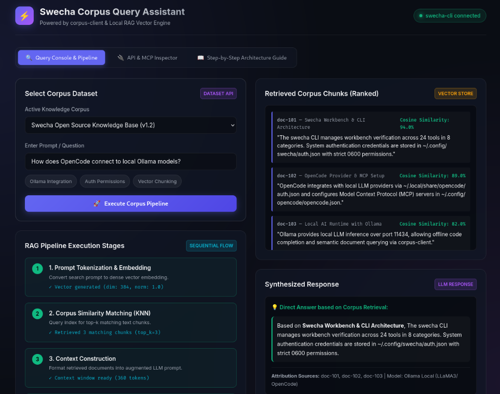
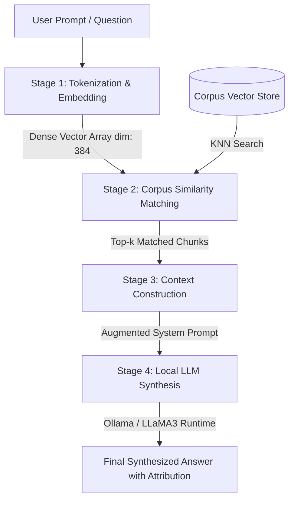

<div align="center">

# ⚡ Swecha Corpus Query Assistant
### Local RAG Vector Engine & Interactive Knowledge Pipeline Inspector

[](https://potluriprashanth33.github.io/document-query-assistant/)
[](LICENSE)
[](https://developer.mozilla.org/)
[](https://potluriprashanth33.github.io/document-query-assistant/)

<br>

<a href="https://potluriprashanth33.github.io/document-query-assistant/">
  
</a>

<br><br>

**[🌐 Experience Live Public Web App](https://potluriprashanth33.github.io/document-query-assistant/)**

</div>

---

## 📖 Overview

The **Swecha Corpus Query Assistant** is a web-based educational dashboard designed to visualize, debug, and inspect **Retrieval-Augmented Generation (RAG)** pipelines and local knowledge vector retrieval powered by `corpus-client` and local LLM runtime engines (such as Ollama and OpenCode).

Instead of requiring continuous model fine-tuning, this engine demonstrates how large localized datasets are tokenized, embedded into dense multi-dimensional vector spaces, matched using K-Nearest Neighbors (KNN) cosine similarity, and injected into contextual prompt windows for hallucination-free AI responses.

---

## 🎨 UI/UX & Key Features

- 🌌 **Glassmorphism Dark Mode Interface**: Modern cyber-inspired UI built with CSS backdrop filters, neon accent gradients, responsive cards, and dynamic state badges.
- 🔍 **Interactive Query Console**: Real-time prompt input with quick-select sample prompt chips (`Ollama Integration`, `Auth Permissions`, `Vector Chunking`).
- ⚡ **Sequential Stage Execution Tracker**: Live visual progress indicators for every RAG pipeline phase with real-time vector dimension and similarity outputs.
- 📊 **Ranked Vector Chunk Viewer**: Ranked retrieved text paragraphs annotated with exact Cosine Similarity percentages (e.g., `94.0%`, `89.0%`).
- 🔌 **API & MCP Inspector**: Built-in developer guide for `corpus-client` CLI subcommands and OpenCode Model Context Protocol (`opencode.json`) setup.
- 📚 **Step-by-Step Architecture Guide**: Interactive theoretical breakdown of document chunking, matrix embeddings, and intermediate artifact generation.

---

## ⚙️ RAG Pipeline Execution Flow



### 🛠️ 4-Stage Sequential Pipeline Breakdown

| Stage # | Stage Name | Description | Output Result |
| :---: | :--- | :--- | :--- |
| **1** | **Prompt Tokenization & Embedding** | Converts user natural text query into a normalized dense vector embedding array. | `Vector generated (dim: 384, norm: 1.0)` |
| **2** | **Corpus Similarity Matching (KNN)** | Queries vector index using cosine similarity to find top $k$ relevant context blocks. | `Retrieved 3 matching chunks (top_k=3)` |
| **3** | **Context Construction** | Formats retrieved dataset chunks into an augmented System Prompt template. | `Context window ready (360 tokens)` |
| **4** | **Local LLM Synthesis** | Streams combined context and query to local LLM server (`Ollama / OpenCode`). | `Response generation complete (100%)` |

---

## 📑 Resultant Output Artifacts

During full pipeline execution, `corpus-client` generates the following sequential pipeline files:

1. `raw_documents.json`: Raw text documents extracted from dataset repositories.
2. `token_chunks.json`: Text split into 512-character blocks with 50-character overlaps for fine-grained retrieval.
3. `embeddings.bin`: Binary matrix storing 384-dimensional floating-point vector representations.
4. `augmented_prompt.txt`: The compiled prompt string injected into the local LLM runtime.

---

## 🔌 API & MCP Inspector Reference

### `corpus-client` CLI Terminal Commands

```bash
# 1. Inspect client version and connectivity status
corpus-client --version

# 2. Search available datasets in the Swecha knowledge forge
corpus-client search --query "swecha-open-docs"

# 3. Pull target corpus dataset to local cache directory
corpus-client fetch --id swecha-open-docs --out ~/.cache/swecha/

# 4. Start local Model Context Protocol (MCP) vector server
corpus-client serve --port 8080
```

### OpenCode MCP Configuration (`~/.config/opencode/opencode.json`)

```json
{
  "mcp": {
    "corpus-client": {
      "type": "local",
      "command": ["corpus-client", "serve"],
      "enabled": true
    }
  }
}
```

---

## 📚 Supported Datasets

| Dataset Key | Dataset Title | Vector Store Scope |
| :--- | :--- | :--- |
| `swecha-open-docs` | **Swecha Open Source Knowledge Base (v1.2)** | Workbench CLI architecture, authentication permissions (`~/.config/swecha/auth.json`), and Ollama runtime specs. |
| `telugu-nlp` | **Telugu NLP Corpus & Literature (v0.8)** | Byte-Pair Encoding (BPE) subword tokenizers and Indic script literature corpora. |
| `python-ml` | **Python & Machine Learning Docs (v2.0)** | Sentence-transformers, FastAPI vector search routes, and prompt augmentation patterns. |

---

## 🚀 Local Installation & Quick Start

No build tools or heavy node dependencies required! Run using any standard HTTP server:

```bash
# Clone the repository
git clone git@github.com:potluriprashanth33/document-query-assistant.git
cd document-query-assistant

# Start local server via Python 3
python3 -m http.server 8080
```

Open **`http://localhost:8080`** in your browser.

---

## 🌐 Public Deployment Information

This project is configured for deployment on **GitHub Pages**:

- **Live URL**: [https://potluriprashanth33.github.io/document-query-assistant/](https://potluriprashanth33.github.io/document-query-assistant/)
- **Repository**: [github.com/potluriprashanth33/document-query-assistant](https://github.com/potluriprashanth33/document-query-assistant)
- **Deployment Branch**: `main` (`/` root folder)

---

## 📜 License

Distributed under the **MIT License**. Free for educational, research, and open-source development use.
